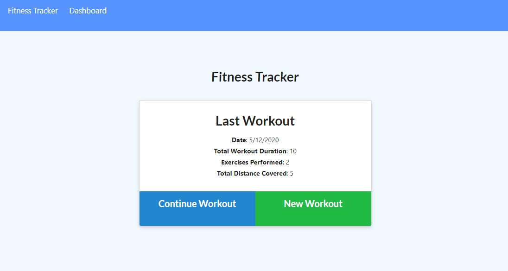
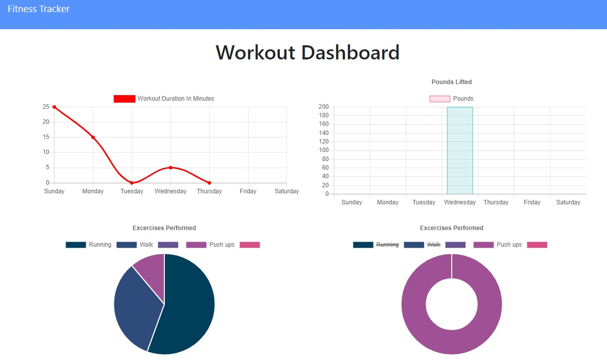

# Workout Tracker
The project focus for this application was to develop a Mongo Database with virtual fields, html and api routes. The database provides persistent data while the routes provide access to the persistent data enabling the application to function.  Trilogy provided the frontend.
The simple graphics are functional and self explanatory. The fitness tracker displays the last workout and provides two buttons, to continue the current workout or start a new circuit/routine.  The menu item Dashboard displays the stats from your workout using chartjs to graph the workout.

## Screen Shots
   
   


## Table of Contents
- [Technologies Used](#Technologies-Used)
- [Learning Points](#Learning-Points)
- [Dependencies](#Dependencies)
- [Installation](#Installation)
- [Code Snippets](#Code-Snippets)
- [Acknowledgements](#Acknoledgements)
- [Authors](#Authors)

## Technologies Used
- MongoDB
- Mongoose ODM
- Chartjs
- Express
- Nodejs
- Bootstrap CSS Framework
- CSS
- HTML5

## Learning Points
### Mongoose Schema options
1. Mongoose options must be in a single object at the end of the Schema.
```
{
        typeKey: '$type',
        toJSON: {
            virtuals: true
        }
    }
```
2. Exercises is an array with a key named 'type'.  Mongooses {typeKey: $type} option enabled to use type property and have a key of 'type'.
3. Virtual Fields (keys), enable the client to pull aggregated data using functions to do some work on the data to simplify rendering for the client. 
```
WorkoutSchema.virtual("totalDuration").get(function () {
    return this.exercises.reduce((total, exercise) => {
        return total += exercise.duration;
    },0);
    
});
```

## Dependencies
- Nodejs installed
- MongoDB installed
- Bash Terminal

## Installation
1. Fork a copy of the repository
2. open a bash terminal
3. mongo
4. use workout
5. CTRL-C
6. npm install
7. node server.js

## Code Snippets
In addition to the Learnings above, the following snippet demonstrates how to update and existing document in Mongo.
Deconstructing the req.body enables to set it as the property of exercises.  Then the object is pushed into the existing document using the documents object ID.
```
    app.put("/api/workouts/:id", ({ body, params }, res) => {
       db.Workout.findByIdAndUpdate(
            params.id,
            { $push: { exercises: [body] } },
            { new: true }
        )
            .then(dbWorkout => {
                res.json(dbWorkout);
            })
            .catch(err => {
                console.log("err", err)
                res.json(err)
            })
    });
```
## Acknowledgements
Trilogy provided the frontend and Seeders to model the database. 

## Authors


[GitHub](https://github.com/chindowns) Michael Downs    
[LinkedIn](www.linkedin.com/in/michaeldownssj) michaeldownssj     
[Portfolio](https://michaeldownsportfolio.herokuapp.com/) on Heroku